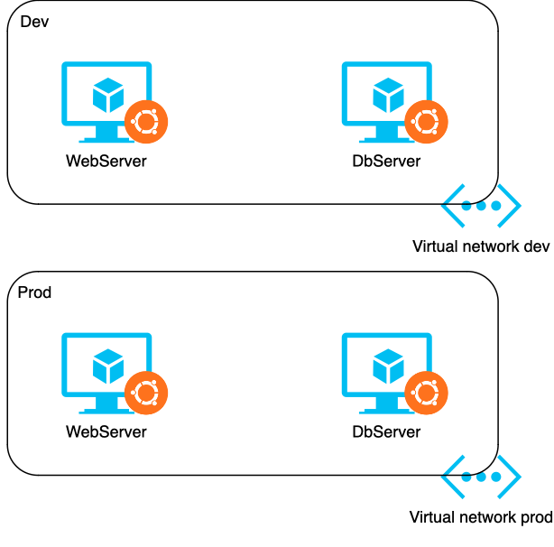
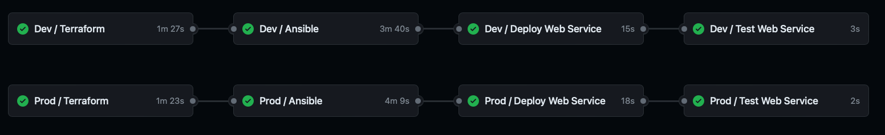

# Table of contents
- [Assumptions](#assumptions)
- [Infrastructure](#infrastructure)
- [Structure](#structure)
- [Pipeline](#pipeline)

## Assumptions

- Infrastructure will run on Azure
- A dev and a prod environments are targeted, and are written in different .tfstate, which are stored on Azure
- Dev and prod run in different networks and dont share any kind of resources
- All machines have public IPs, to avoid the need of a jumphost
- The webservice run on its built-in web server, no additinal web server has been installed
- The execution of subsequent commands is managed by a Github pipeline
- The environments can be deployed and configured in parallel, no promotion mechanism is needed

## Infrastructure



Two machines run in a single virtual network.
One work as a web server, the other as a database server. <br/>
The two environments are identical and dont share resources.

## Structure

- `.github/workflow` folder contains the pipeline that generates and configure the web servers for both environments
- `infrastructure` folder contains terraform files

To run terraform:
```bash
# Dev environment
terraform -chdir=infrastructure/environments/dev init
terraform -chdir=infrastructure/environments/dev apply

# Prod environment
terraform -chdir=infrastructure/environments/prod init
terraform -chdir=infrastructure/environments/prod apply
```

- `playbooks` folder contains ansible run playbooks
  
To run playbooks:
```bash
ansible-playbook --private-key <private_key> -i playbooks/inventory.yaml playbooks/main.yaml -e "db_host=<db_public_ip> webserver_host=<webserver_public_ip>"
```

- `webservice` folder contains a flask api that runs on port 80, which exposes the endpoint `/fakedata` that query a MongoDB running on the dbserver

## Pipeline

The pipeline that wraps the deployment of infrastructure and its configuration can be found [here](./.github/workflows/deploy.yaml).



This automation run the deployment of both environments at the same time. </br>
Pipeline stages consist of:
1. Run terraform to create infrastructure. It generates the SDN and the two virtual machines
2. Run ansible playbook. It installs the systemd service on the webserver and installs mongodb and populate it with fakedata on the dbserver
3. Deploy the web service, install its required libraries and run the service
4. Perform a test by calling the endpoint of the webserver expecting an HTTP 200 response


An example of a successful run can be seen [here](https://github.com/Stepness/devops-takehome/actions/runs/9931265728).